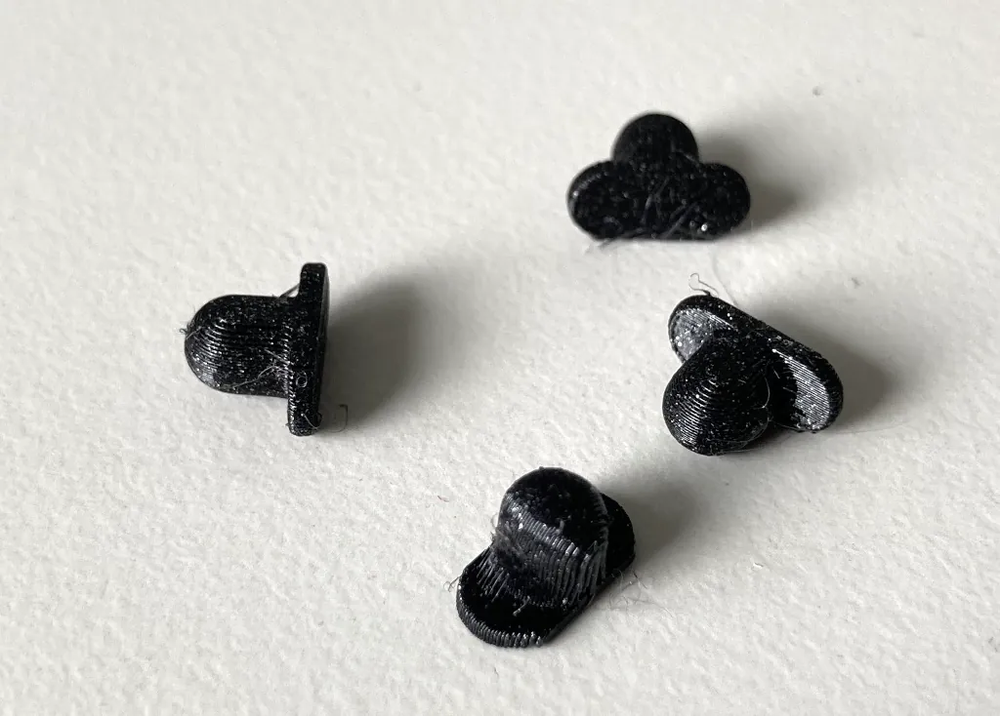

# OpenSCAD Projects
Monorepo with OpenSCAD projects for functional 3D printed parts.

Compatible with OpenSCAD release 2021.01 or later.

| Folder | Image | Description |
|--------|-------|-------------|
| [gopro3_lens_adapter](gopro3_lens_adapter/README.md) |  | Adapter for attaching lenses or circular filters to a GoPro Hero 3. |
| [gopro_la2205wg_mount](gopro_la2205wg_mount/README.md) |  | Adapter for mounting a GoPro on an HP LA2205WG external monitor. |
| [hultarp_hook_pin](hultarp_hook_pin/README.md) |  | Pins that stop [IKEA Hultarp hooks](https://www.ikea.com/us/en/p/hultarp-hook-black-10444445/) from falling off the rail. |
| [tidafors_foot_extension](tidafors_foot_extension/README.md) |  | Printable couch feet extensions to make a robot vacuum fit underneath an [IKEA Tidafors couch](https://www.ikea.com/us/en/assembly_instructions/tidafors-sofa-bed__AA-509180-4_pub.PDF). |

## License
GNU LGPLv3, except for external dependencies bundled with this repo, or unless specified otherwise.
