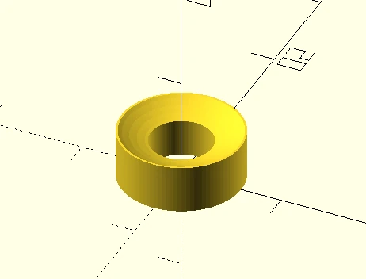

# OpenSCAD Projects
Monorepo with OpenSCAD projects for functional and decorative 3D printed objects.

- [Getting Started](#getting-started)
- [Functional Objects](#functional-objects)
    - [GoPro-related](#gopro-related)
- [Decorative Objects](#decorative-objects)
- [License](#license)

## Getting Started
To customize models:
1. Clone this entire repo
2. Install OpenScad release 2021.01 or later: https://openscad.org/index.html
    * if you are new to OpenSCAD, consider reading about its [user interface](https://en.wikibooks.org/wiki/OpenSCAD_User_Manual/The_OpenSCAD_User_Interface) and [how to export STL files](https://en.wikibooks.org/wiki/OpenSCAD_User_Manual/STL_Export)
3. Check the README of each model for hints on how/what to customize

## Functional Objects

| Folder | Image | Description | Pre-generated STL files |
|--------|-------|-------------|-----------|
| [audio_jack_through_hole_mount](audio_jack_through_hole_mount) |  | Kludge for adding an AUX IN jack to a car dashboard. | |
| [bambu_refill_on_prusa_spool](bambu_refill_on_prusa_spool) |  | Repurpose a Prusament spool to fit Bambulab refills. | [printables.com](https://www.printables.com/model/879492-bambu-refill-on-prusa-spool) |
| [bathroom_lamp_mount](bathroom_lamp_mount) |  | Instead of drilling more holes into bathroom tiles, print an adapter that reuses the existing holes. | |
| [cartographers_tiles](cartographers_tiles) |  | Tangible version of the tiles from the [Cartographers](https://boardgamegeek.com/boardgame/263918/cartographers) and [Cartographers Heroes](https://boardgamegeek.com/boardgame/315767/cartographers-heroes) board games. | [printables.com](https://www.printables.com/model/772490-tiles-for-cartographers) |
| [dokument_letter_tray_mount](dokument_letter_tray_mount) |  | Adapter for mounting an [IKEA Dokument letter tray](https://www.ikea.cn/cn/en/assembly_instructions/dokument-letter-tray__AA-367796-2_pub.PDF) to the underside of a table. | [thingiverse.com](https://www.thingiverse.com/thing:2759384) |
| [graphite_powder_bottle_cap](graphite_powder_bottle_cap) |  | Friction fit cap for graphite powder bottles. | [printables.com](https://www.printables.com/model/800242) |
| [hultarp_hook_pin](hultarp_hook_pin) |  | Pins that stop [IKEA Hultarp hooks](https://www.ikea.com/us/en/p/hultarp-hook-black-10444445/) from falling off the rail. | [printables.com](https://www.printables.com/model/544662-ikea-hultarp-hook-pin) |
| [niecorol_blinds_mount](niecorol_blinds_mount) |  | Adapter for attaching Nie-Co-Rol plant supports to roller blinds. | |
| [spdrs60_empty_panel_holder](spdrs60_empty_panel_holder) |  | Holder for empty panels within the control panel of German SpDrS60 railway control centers. | |
| [shelf_cable_clip](shelf_cable_clip) |  | Cable management clips with extra strong grip for IKEA Kallax, Besta, and others. | [printables.com](https://www.printables.com/model/558365) |
| [slatted_frame_spacer](slatted_frame_spacer) |  | Prevents slatted frames from slipping in a double bed. | |
| [smart_card_dummy](smart_card_dummy) |  | Dust protector for smart card readers. | [printables.com](https://www.printables.com/model/565108/) |
| [soap_dish_wavy_circular](soap_dish_wavy_circular) |  | Remake of this [this rectangular soap dish](https://www.printables.com/model/213202-modern-soap-dish-with-removable-collection-tray) with circular footprint. | [printables.com](https://www.printables.com/model/551876) |
| [staple_remover_locking_pin](staple_remover_locking_pin) |  | Replacement for a broken staple remover locking pin. | [printables.com](https://www.printables.com/model/1006313-staple-remover-locking-pin) |
| [straw_rack](straw_rack) |  | Efficient storage for metal straws in a drawer. | [printables.com](https://www.printables.com/model/1248734-space-efficient-straw-rack) |
| [tidafors_foot_extension](tidafors_foot_extension) |  | Printable couch feet extensions to make a robot vacuum fit underneath an [IKEA Tidafors couch](https://www.ikea.com/us/en/assembly_instructions/tidafors-sofa-bed__AA-509180-4_pub.PDF). | [printables.com](https://www.printables.com/model/544671-extension-for-ikea-tidafors-couch-feet) |
| [vbrake_washer](vbrake_washer) |  | Temporary washer for V-Brake pads | |
| [x220t_hdd_lid](x220t_hdd_lid) |  | Thinkpad X220 Tablet hard drive lid. | |

### GoPro-related
I sure seem to like mounting cameras on things...

| Folder | Image | Description | Pre-generated STL files |
|--------|-------|-------------|-----------|
| [capture_card_monitor_pole_mount](capture_card_monitor_pole_mount) |  | Capture card mount for monitors with pole-shaped stands. | |
| [gopro3_lens_adapter](gopro3_lens_adapter) |  | Adapter for attaching lenses or circular filters to a GoPro Hero 3. | [printables.com](https://www.printables.com/model/544654-gopro-hero-3-lens-adapter) |
| [gopro_la2205wg_mount](gopro_la2205wg_mount) |  | Adapter for mounting a GoPro on an HP LA2205WG external monitor. | |
| [gopro_monitor_pole_mount](gopro_monitor_pole_mount) |   | GoPro mounts for monitors with pole-shaped stands. | [printables.com](https://www.printables.com/model/545721/) |

## Decorative Objects

| Folder | Image | Description | Pre-generated STL files |
|--------|-------|-------------|-----------|
| [neural_network_trophy](neural_network_trophy) |  | This trophy recognizes outstanding achievements in the study of neural networks. | |

## License
GNU LGPLv3, unless specified otherwise.

External dependencies bundled with this repo (see [shared/external](shared/external)):
* `threads.scad`: developed by Ryan Colyer, released under CC0-1.0 license, https://github.com/rcolyer/threads-scad
* `text_on.scad`: developed by Brody Kenrick, released under GNU LGPL v2.1 license, https://github.com/brodykenrick/text_on_OpenSCAD
* `GoPro_Mount.scad`: developed by Thingiverse user [julietta](https://www.thingiverse.com/julietta/), released under BSD license, https://www.thingiverse.com/thing:3088912
