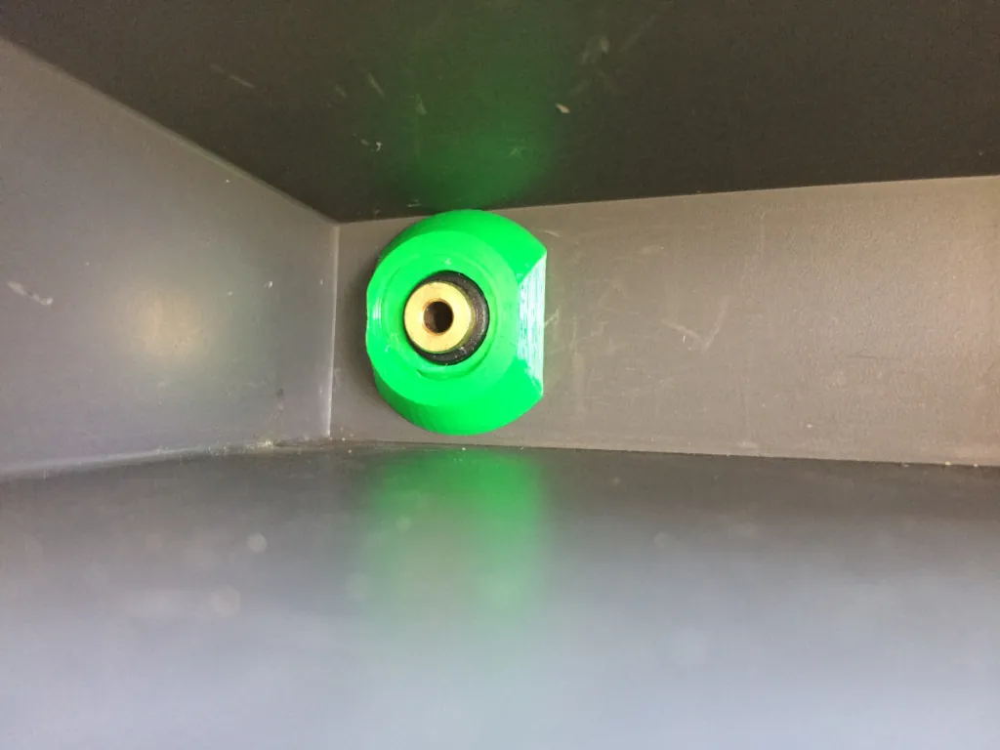
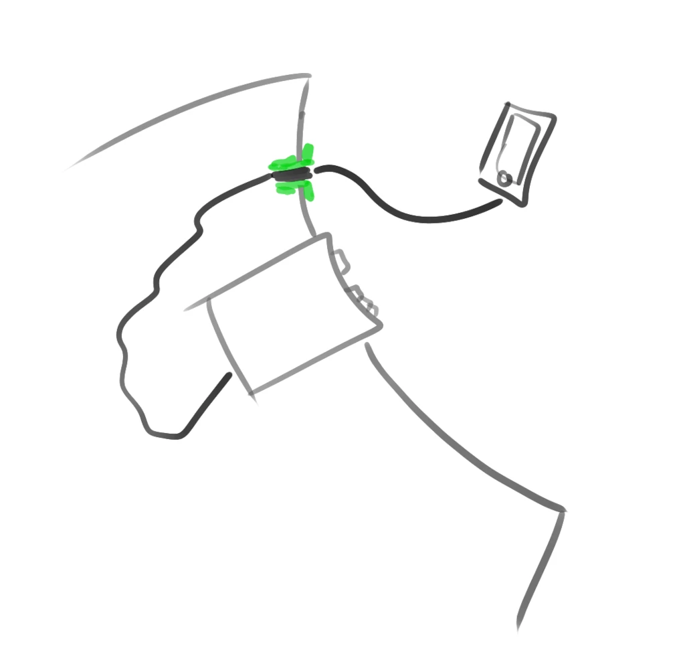

# Audio Jack Through-Hole Mount
When your car has a radio with AUX input but there is no audio jack on the dashboard to connect it to, you need the audio jack through-hole mount. And a drill, and hot glue, and a predisposition for kludges.

## Assembly
1. Print `shoe.scad` and `nut.scad`. The thread tolerances in the model are not perfect, so there are three nuts. At least one should fit well.
2. Remove car radio, plug in one end of the audio cable into the radio, hot-glue the other into the shoe.
3. Drill a hole into the dashboard, feed the shoe through from behind, and lock it in place with the nut.
4. Reinstall the car radio.

## Print Settings
* printer: Prusa MK3
* filament: ASA recommended, but mine is PETG
* print settings: 0.2mm, no supports

## External Dependencies
* `quickthread.scad`: developed by Thingiverse user [arpruss](https://www.thingiverse.com/arpruss/), released under CC-BY 3.0 license, https://www.thingiverse.com/thing:2277141
