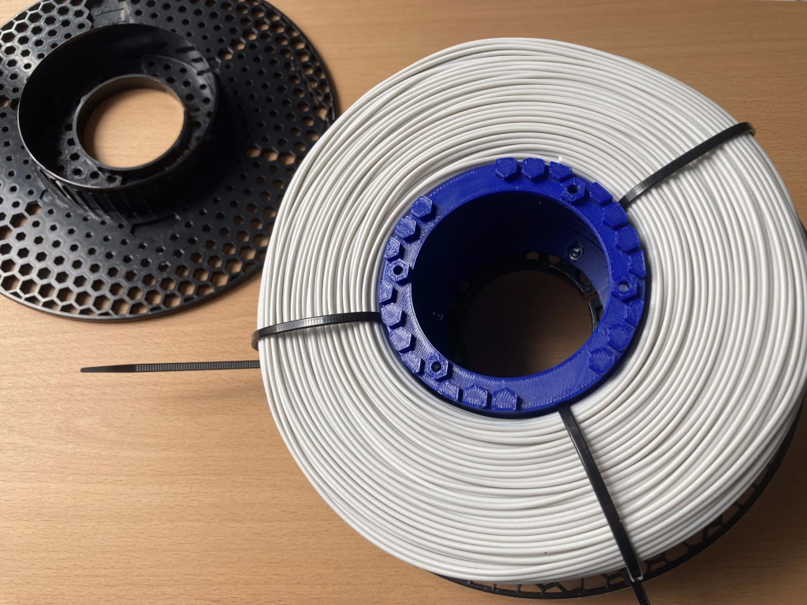
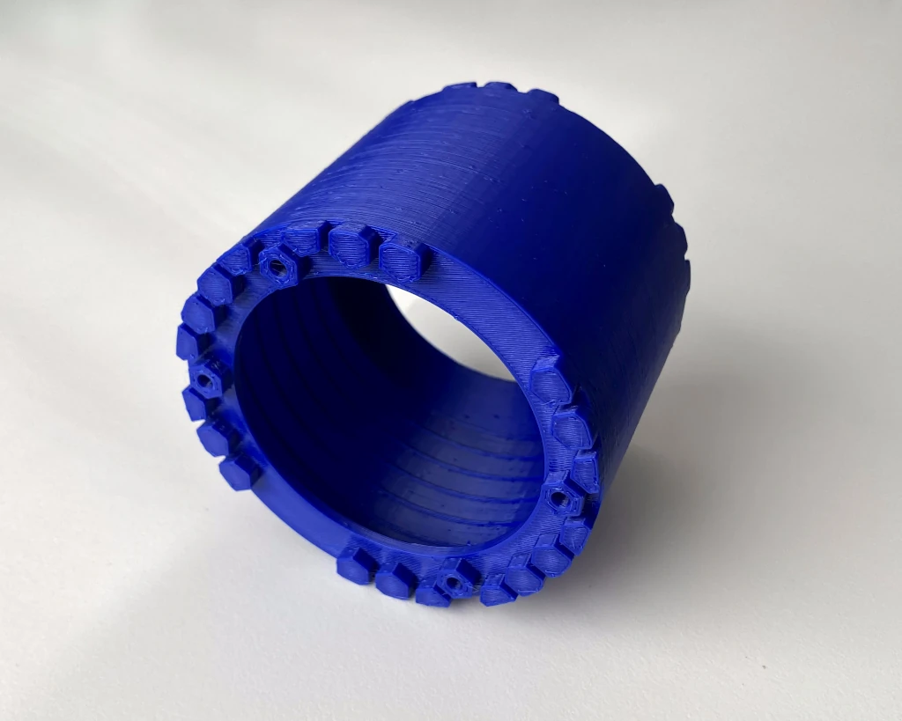
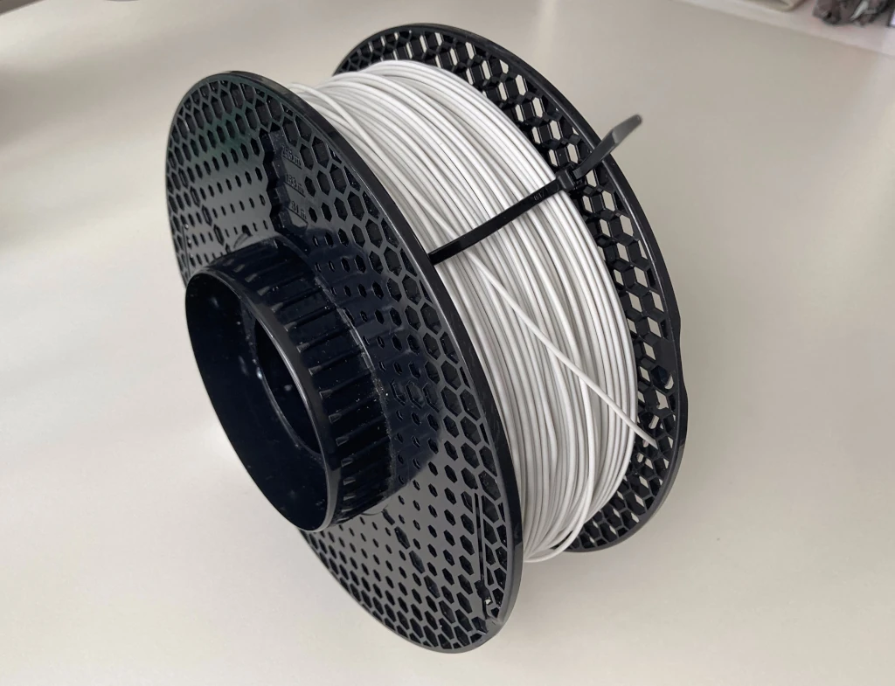
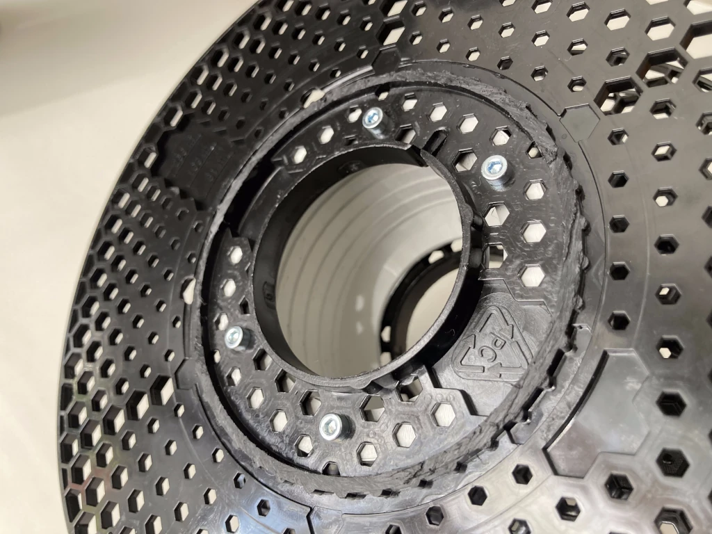
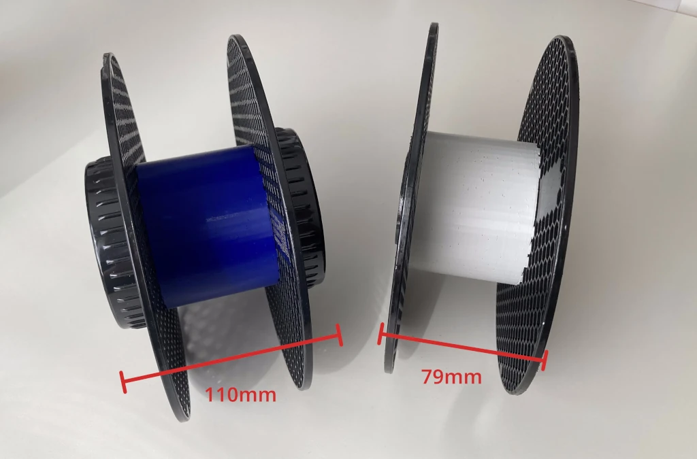

# Bambulab Refill on Prusament Spool
Bambulab filament refills do not fit on Prusament spools because the core diameter on Prusament spools is larger (100mm > 81.5mm).
With this model, you can build a custom spool that can fits Bambulab refills from an empty Prusament spool and some screws.

Features:
* Repurpose the polycarbonate parts of a Prusament spool instead of throwing them away.
* Filament-saving: can be printed from ~45g of filament, less than half of what's needed for a typical Bambulab master spool.
* Potential downside: the reassembled spool is 110mm wide (79mm if the protruding bits are cut off). Either way, it will not be AMS compatible.

## Materials
- 45g of filament
- 8x M3x20 screws, doesn't matter if they are cylinder or hexagon head.
    - M3x10 work as well, but are more finicky to assemble.
- 8x M3 hex nut

## Print Instructions
- enable supports for the bottom 10mm (anything above prints without supports)
- random seam position recommended
- 10% infill is sufficient

See the 3MF with my print settings.

## Model Customization
Custom dimensions can be configured via the OpenSCAD source files, located at https://github.com/mbugert/openscad-projects/tree/main/bambu_refill_on_prusa_spool

---

