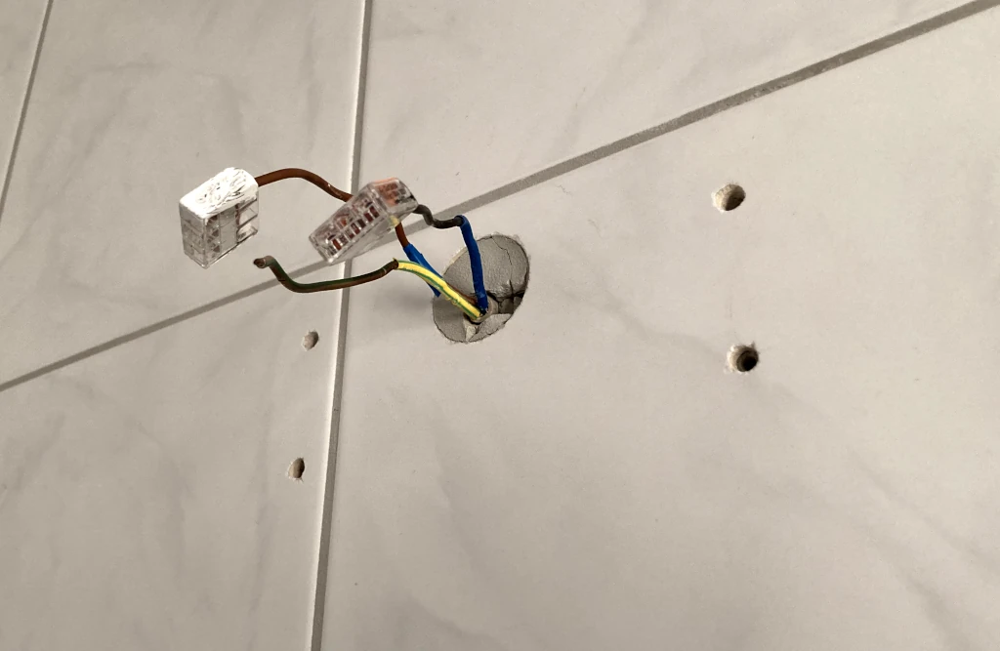
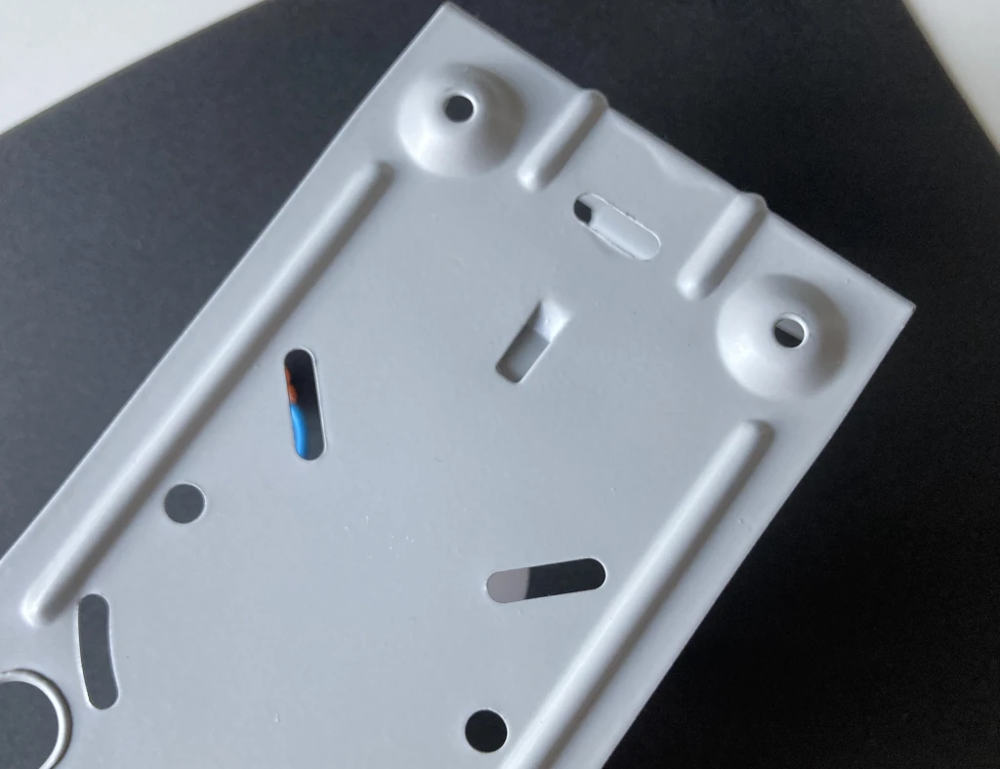
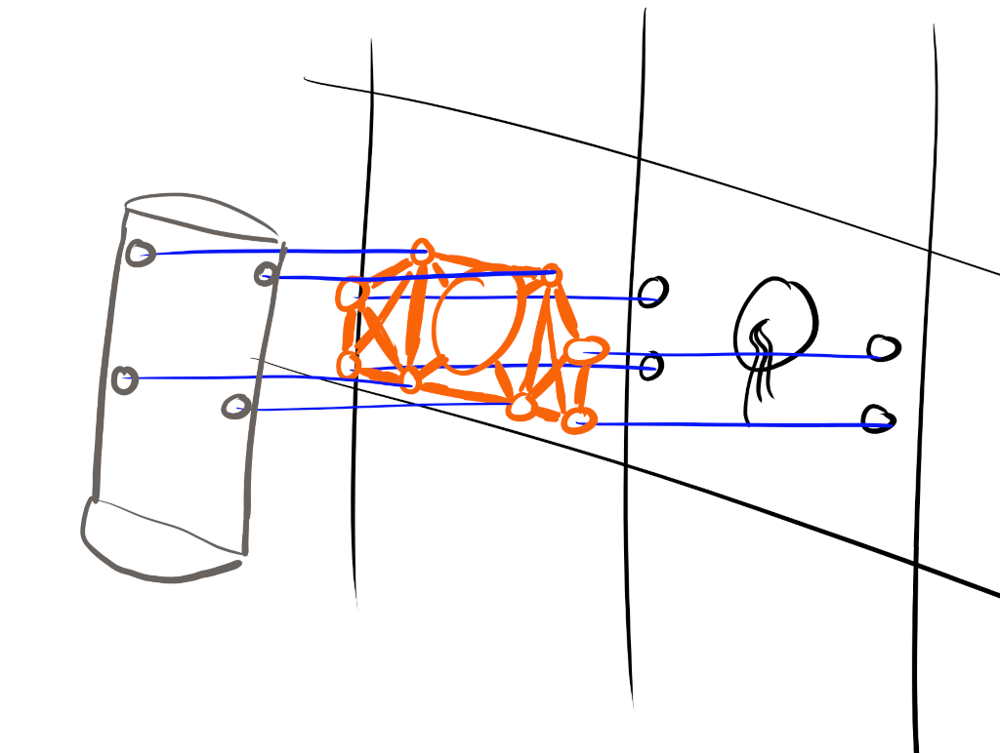
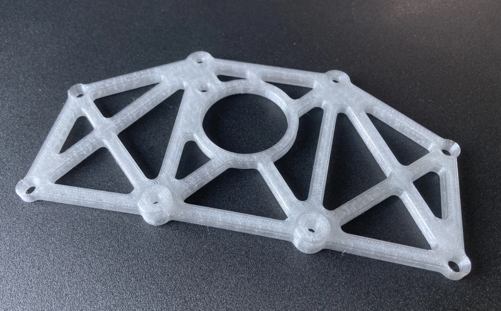
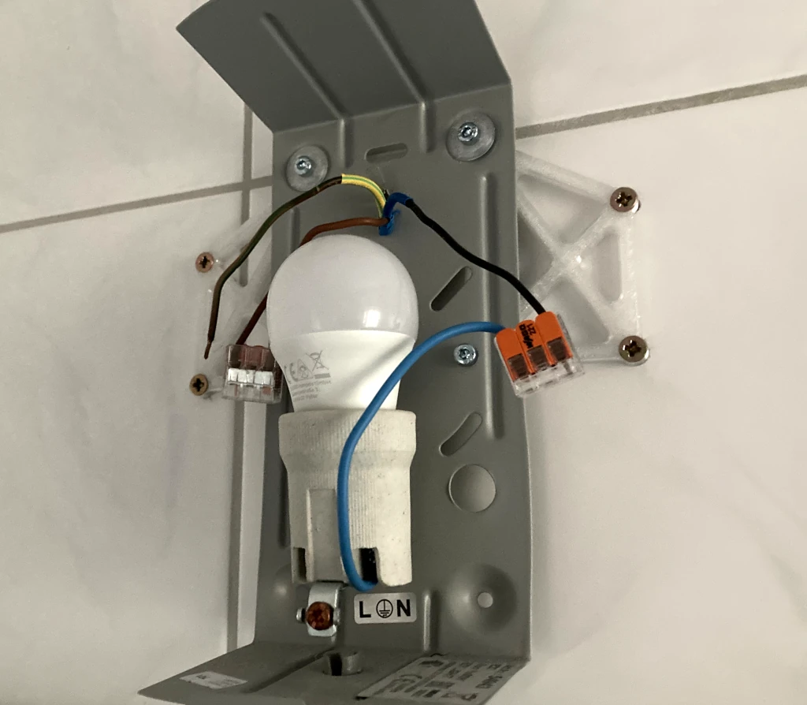

# Bathroom Lamp Mount
If you need to mount a bathroom lamp, already have drilled holes in the tiles from the previous tenant, realize the holes don't line up, and have a landlord that doesn't fancy more holes being drilled, you need this contraption.

I guess woodworking would have been faster for this one, even without a workshop. Anyway...

## Assembly
- print `mount.scad` and 2x `washer.scad`
- affix the lamp to the mount with four M4x10 bolts four M4 hex nuts, and using the two washers
- connect cables
- mount assembly on the wall with four M4x40 countersunk screws

## Print Settings
* printer: Prusa Mini+
* filament: transparent Prusament PETG
* print settings: 0.2mm, no supports
