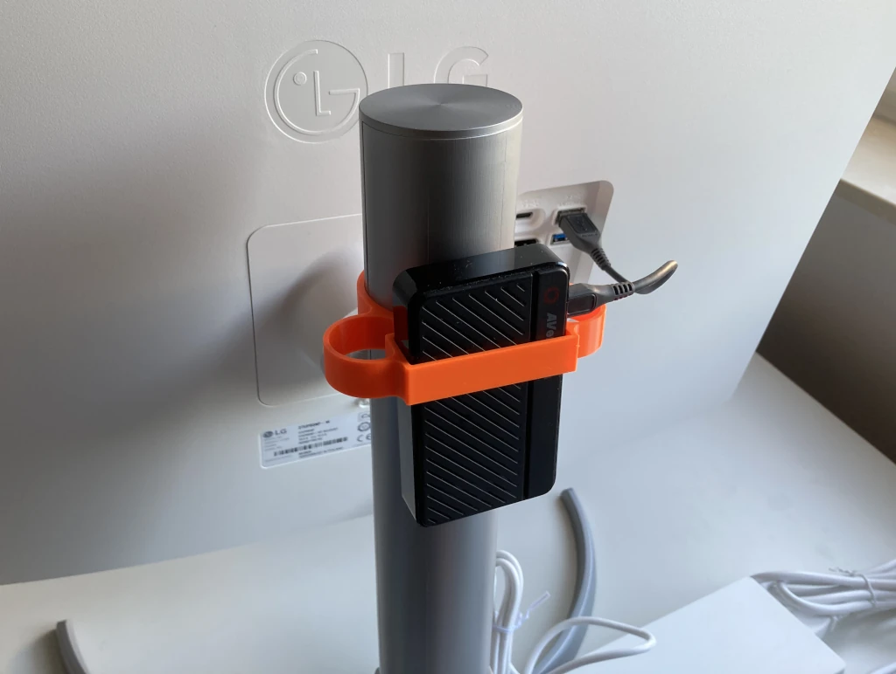

# Capture Card Mount for Pole-Shaped Monitor Stands
With the GoPro [mounted on top of the monitor stand](../gopro_monitor_pole_mount/), it only makes sense to mount the capture card right below on the same pole. As the capture card, I use an [AverMedia Live Gamer Mini](https://www.avermedia.com/de/product-detail/GC311).

## Print Settings
* printer: Prusa Mini+
* filament: Prusament PLA Orange
* print settings: 0.2mm, no supports
