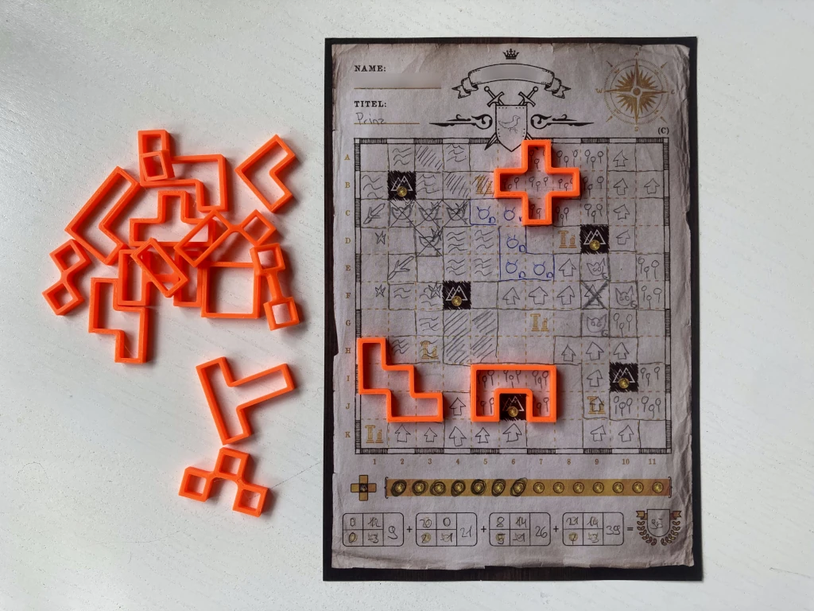

# Tiles for Cartographers
In [Cartographers](https://boardgamegeek.com/boardgame/263918/cartographers) and [Cartographers Heroes](https://boardgamegeek.com/boardgame/315767/cartographers-heroes), some players find it easier to flip & rotate a physical object to plan their move, which often leads to them grabbing the card and holding it hostage until they are done. 🙃

No more! Just print these tangible tiles and harmony will be restored at the table.

## Customization
To customize and export STL files, open `tiles.scad` and use [OpenSCAD's customizer panel](https://en.wikibooks.org/wiki/OpenSCAD_User_Manual/Customizer#Activation_of_Customizer_panel).
This model also showcases the wonders (or horrors?) of OpenSCAD being a functional language.
