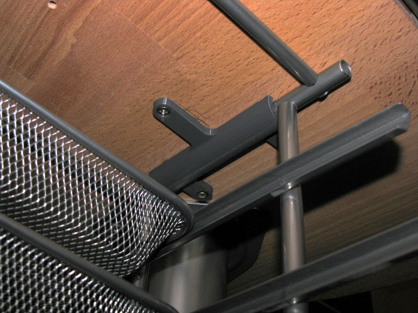

# Upside-down IKEA Dokument Letter Tray Mount
For mounting an [IKEA Dokument letter tray](https://www.ikea.cn/cn/en/assembly_instructions/dokument-letter-tray__AA-367796-2_pub.PDF) to the underside of a table.

## Print Settings
* printer: Prusa i3 MK2S
* filament: PLA
* print settings: 0.2mm, no supports

## Assembly
### Tools/Materials
* IKEA Dokument letter tray
* metal saw
* six M3.5 screws
* 3D printer, duh

### Steps
1. Print `dokument_letter_tray_mount.scad` twice
2. Use the saw to remove the bent sections of the letter tray (where the feet are attached)
3. Screw the letter tray to the underside of a table of your choice

## External Dependencies
* `2dfillet.scad`: developed by Thingiverse user [TakeItAndRun](https://www.thingiverse.com/TakeItAndRun/), released under GPLv2 license, https://www.thingiverse.com/thing:422252

## License
GPLv3
