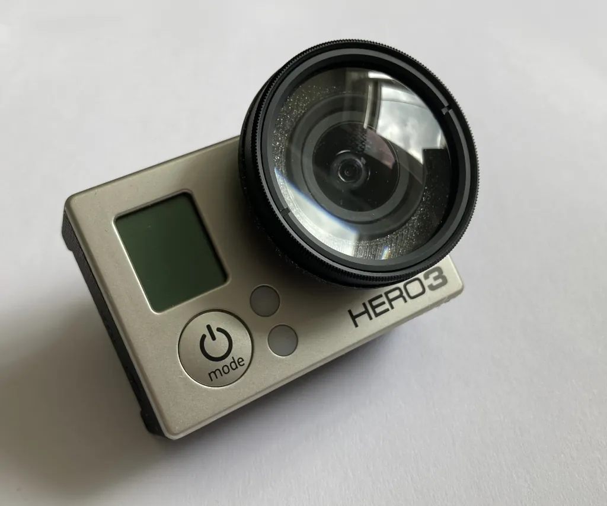

# GoPro Hero 3 Lens Adapter
Taking macro shots with a GoPro requires a separate macro lens like [these 37mm ones](https://www.amazon.de/gp/product/B07P2Y1ZR5/), which also require an adapter for attaching.
The markup on these adapters is huge (at least 5€ on ebay), whereas power and materials for printing an adapter sum up to less than 20ct.

Camera perspective:

## Print Settings
* printer: Prusa Mini+
* filament: Prusament PLA Galaxy Black
* print settings: 0.2mm, no supports

The printed adapter is simply slid onto the built-in lens.

## Customization
For a lens diameter other than 37mm, change `lens_d` in the SCAD file. There is variance in GoPro lens dimensions (for the GoPros I own, the fit varies between snug and loose), so some experimentation with `gopro_lens_outer_d` may be necessary.

If your printer can print overhangs well, flatter adapters can be printed by reducing `printer_max_overhang_degrees` in [common.scad](../shared/common.scad).
