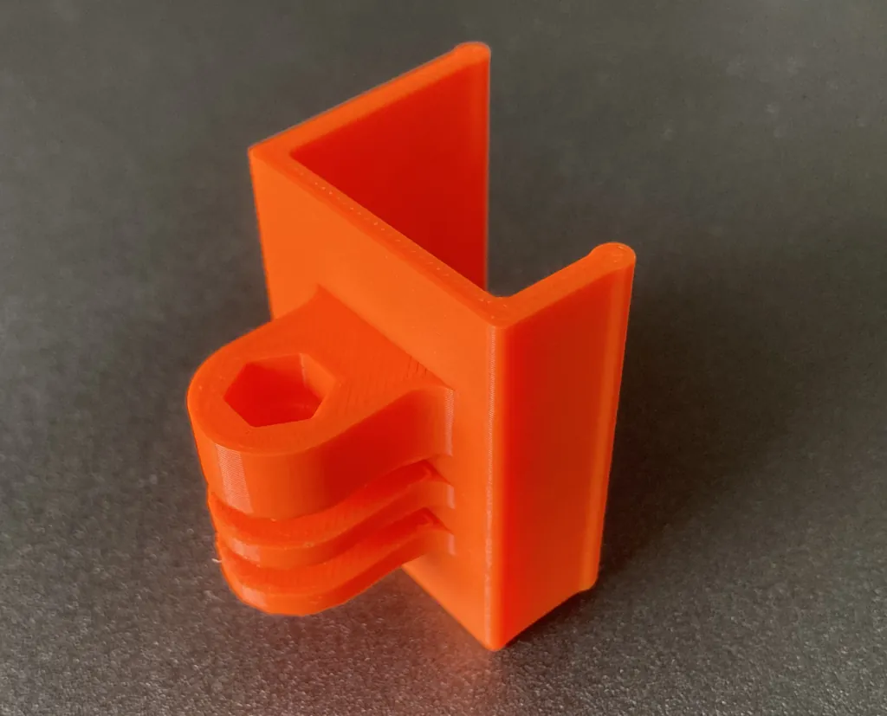

# GoPro Mount for HP LA2205WG
Adapter for mounting a GoPro on an external monitor. The monitor: HP LA2205WG [[1]](https://support.hp.com/de-de/product/hp-compaq-la2205wg-22-inch-widescreen-lcd-monitor/3955309)[[2]](https://www.prad.de/testberichte/test-monitor-hp-compaq-la2205wg/).

I don't expect anyone to own that particular monitor, but the design can be easily adjusted to monitors with similarly shaped bezels.

The GoPro frame used in the second picture is this one: https://www.printables.com/model/202221-gopro-hero-3-improved-top-and-bottom-frame-mounts

### Print Settings
* printer: Prusa Mini+
* filament: Prusament PLA Orange
* print settings: 0.2mm with supports
    * print orientation: 
      There will be supports between the adapter winglets which are annoying to remove. Printing it this way will make the visible areas of the part look great though.
