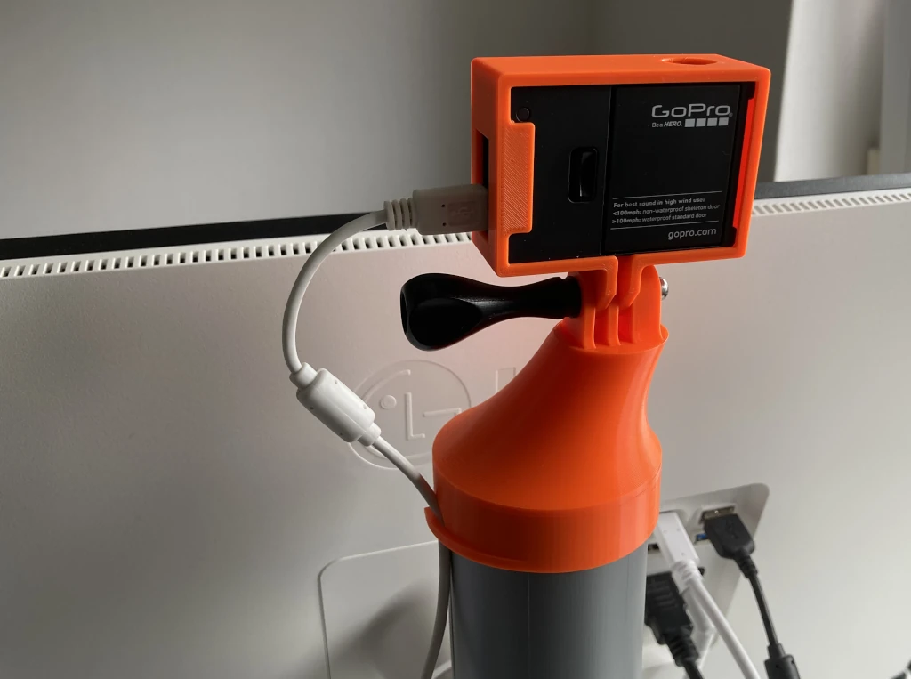
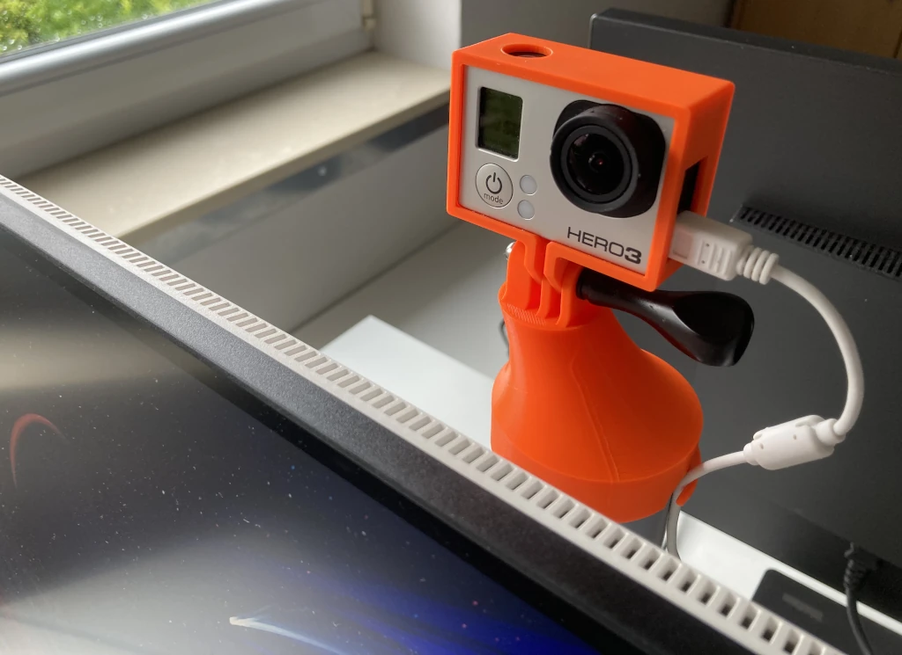
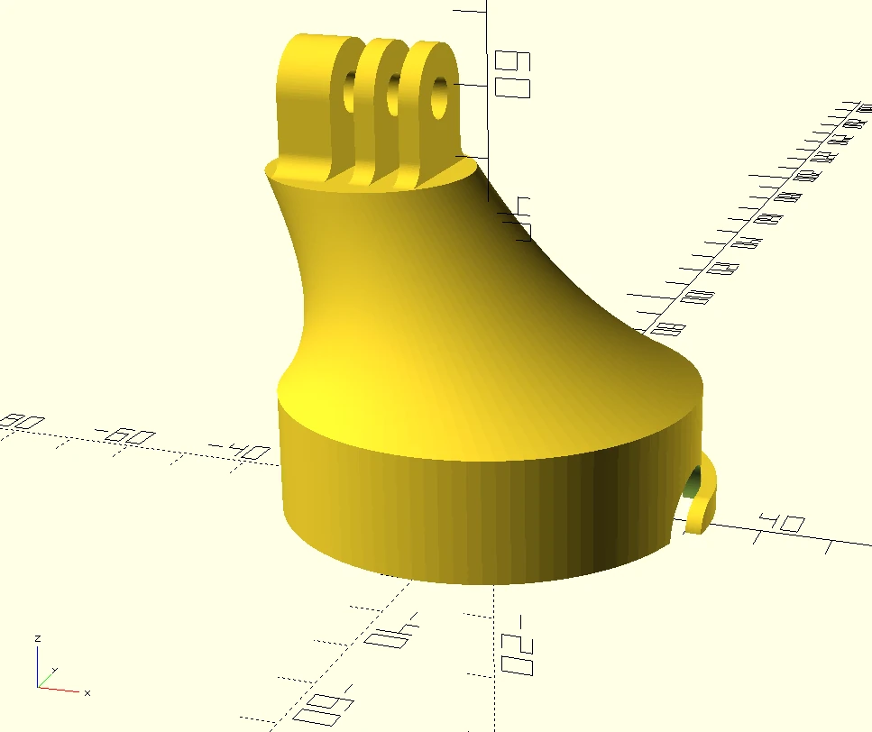
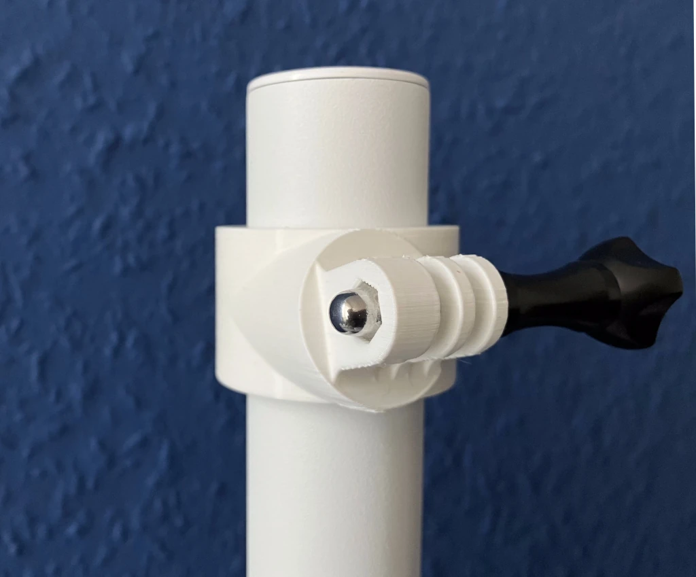

# GoPro Mount for Pole-Shaped Monitor Stands
GoPro mounts for monitors with pole-shaped stands, in two design types: hat and ring shaped mounts.

`make.py` creates STLs for mounting a GoPro Hero 3 on:
- an LG Ultrafine 27UP85NP [[1]](https://www.lg.com/uk/monitors/uhd-4k-5k/27up85np-w/)
- a Lenovo Thinkvision P27h-30 [[2]](https://www.lenovo.com/gh/en/monitors/p27h-30)
- Ergotron LX poles [[3]](https://www.ergotron.com/en-gb/products/product-details/45-509#)

To make this design work for other monitor stands, adjust `pole_d` in `gopro_monitor_pole_mount.scad`.

## Hat Type
The GoPro sits on top of the pole. The mount is offset to center the lens on the pole, and a little cable holder is included.

The GoPro frame used in pictures 1 and 2 is this one: https://www.printables.com/model/202221-gopro-hero-3-improved-top-and-bottom-frame-mounts

### Print Settings
* printer: Prusa Mini+
* filament: Prusament PLA Orange
* print settings: 0.2mm with supports (lots of them 😢)

### Customization
* The mount needs to be tall enough that the camera can peek over the monitor. By default, the GoPro mounting axle is located 3cm above the end of the pole (`cam_raise_z = 30`). For tall or vertically oriented monitors, larger values might be required.
* GoPros other than Hero 3 might require a different `cam_lens_offset_x` to be horizontally centered.

## Ring Type

### Assembly
You need an M3 threaded insert and an M3 screw (grub screw preferred for better looks).
