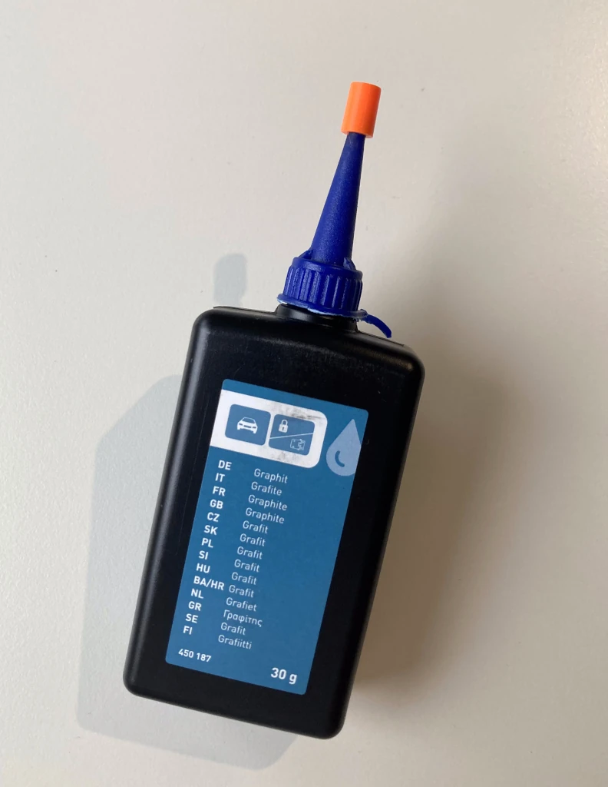

# Graphite Powder Bottle Cap
Friction fit cap for graphite powder bottles.

I need it because I keep cutting the top off incorrectly, or the flimsy plastic cap gets torn off at some point.

Can be printed from 0.4g of leftover PLA (14cm with 1.75mm filament).

