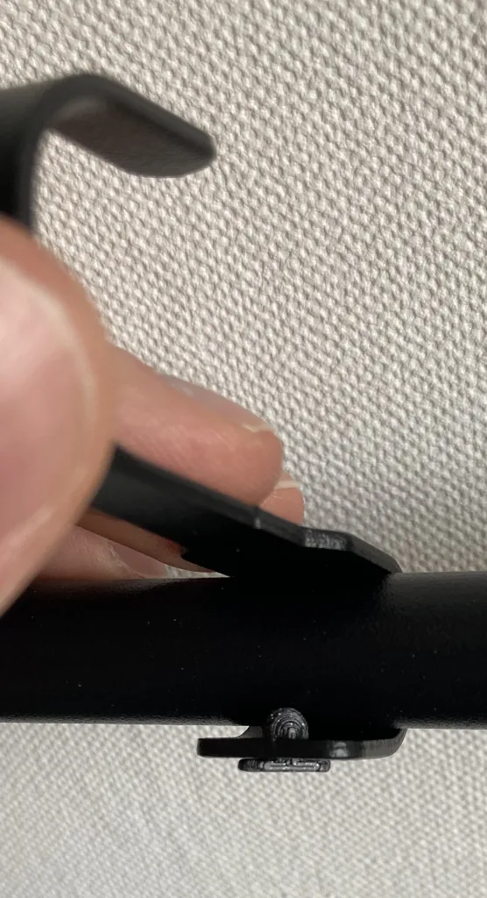

# IKEA Hultarp Hook Pin
IKEA sells [hooks to put on a rail](https://www.ikea.com/us/en/p/hultarp-hook-black-10444445/) ([archive.org](https://web.archive.org/web/20230111064719/https://www.ikea.com/us/en/p/hultarp-hook-black-10444445/)), but they come loose easily.
This pin fixes that. This is a remake of [this design by @Lennnard](https://www.printables.com/model/328331-hultarp-locking-pin) with dimensions that worked better on my Prusa MINI+.

## Print Settings
* printer: Prusa Mini+
* filament: Prusament PLA Galaxy Black
