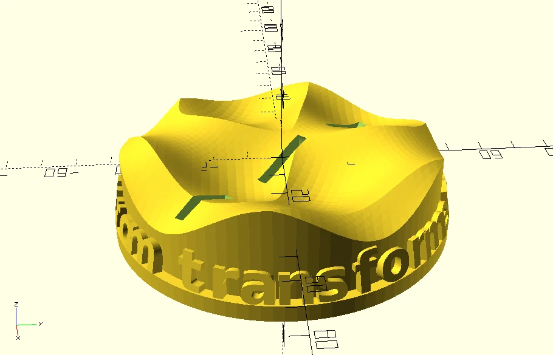
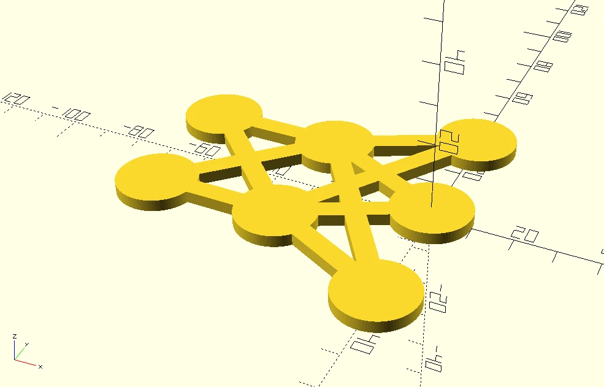

# Neural Network Trophy
This trophy was awarded to the group of students who placed first in the final project of our university lecture on deep learning. Good times!

## Assembly
1. Run `make.py` to export STL and DXF files with a custom message on the trophy, for example `./make.py "from transformers import *"`

    The `text_on.scad` library may print several uncritical warnings.
2. 3D print `target/pedestal.stl`
3. For the MLP statue, either print `target/statue.stl` or laser cut `target/statue_2d.dxf` from 3mm thick acrylic
4. Snap fit both parts together.
