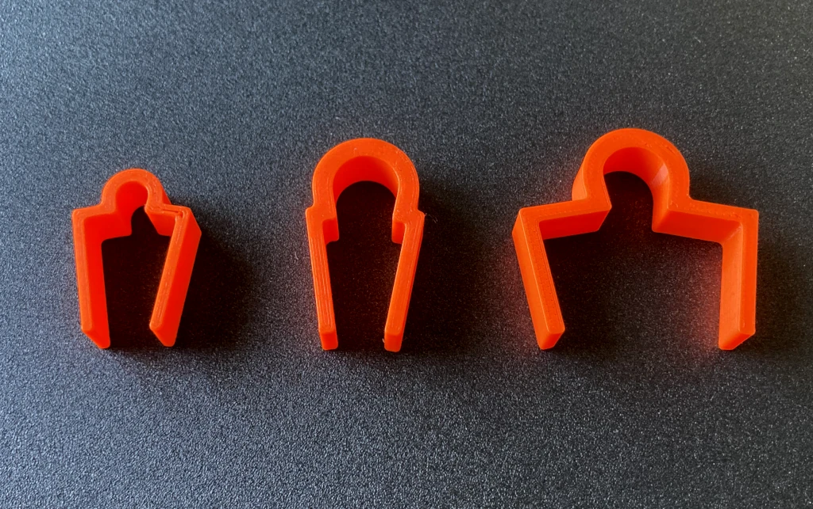

# Strong Cable Clip
Extra strong grip, straight from the printer. Fits Kallax, Besta, or can be customized to any other shelf/desk.
I tried similar models from printables.com, but they all had bad tolerances or weak grip strength, so I designed my own.

I stacked 200g worth of stuff on the clip and it didn't move. Without needing tape for extra friction.

Sample prints: Kallax inner for 5mm cable diameter, Kallax inner for 11mm cable diameter, and Kallax outer for 11mm diameter.

## Print Settings
* printer: Prusa Mini+
* filament: transparent Prusament PETG, Prusament PLA Orange
* print settings: 0.2mm, no supports

## Customization
`make.py` creates STLs for several well-known shelves (see below). For custom shelf thicknesses, larger cable diameters, and so on, open `clip.scad` and use [OpenSCAD's customizer panel](https://en.wikibooks.org/wiki/OpenSCAD_User_Manual/Customizer#Activation_of_Customizer_panel).

### Presets
* IKEA Kallax inner shelves (16.2mm)
* IKEA Kallax outer walls (37.2mm)
* IKEA Besta shelves and outer walls (18.35mm)
* IKEA Besta top shelf (30.7mm)
* IKEA Besta center wall (37.7mm)
* IKEA Lack desk and legs (50.25mm)
* generic shelves (18.35mm)
    * this size fits IKEA Metod shelves and non-IKEA branded shelves, so chances are that it will fit for many others too
