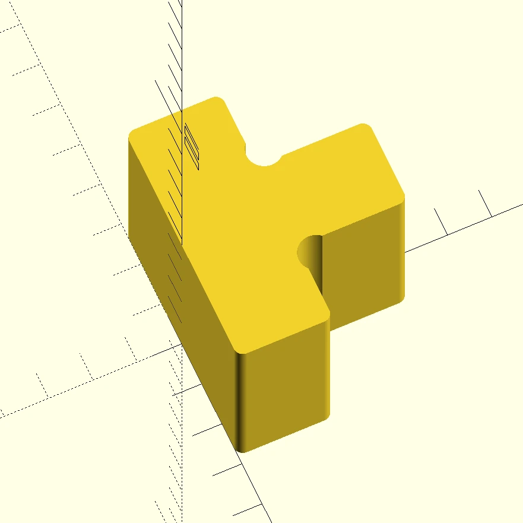

# Slatted Frame Spacer
Using two separated slatted frames on a double bed tends to leave gaps between the frames that makes them prone to slipping.
This spacer fills these gaps. Print two and place one at the head end and one at the foot end. After taking measurements and adjusting the design parameters, of course. 🙂

