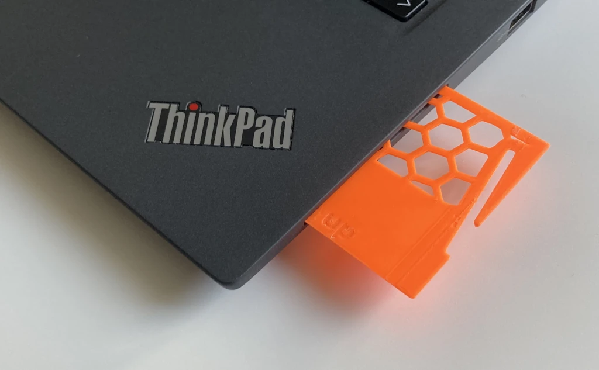

# Smart Card Dummy
It protects smart card readers from dust. It can also be used as a residue-free alternative to stickers for identifying laptops (when printed in different colors).

It's completely flush when inserted. This way it cannot get caught anywhere in the laptop bag.

To remove it again, insert the end of a (non-coated) paperclip.

The honeycomb pattern saves filament, and the non-honeycomb section prevents the card detection mechanism from getting stuck in the honeycomb pattern.

## Print Settings
* printer: Prusa Mini+
* filament: Prusament PLA Orange
* print settings:
    * **0.15mm layer height** (the part is designed for this layer height)
    * ironing on all top-level surfaces

## Customization
`make.py` creates STLs for two ThinkPads I had available (see below). To customize the dummy to to other laptops, open `dummy.scad` and use [OpenSCAD's customizer panel](https://en.wikibooks.org/wiki/OpenSCAD_User_Manual/Customizer#Activation_of_Customizer_panel).

### Presets
| Laptop Model   | Reader location | Card sticks out by |
|----------------|-----------------|-------------------:|
| ThinkPad T14s  | right side      | 25mm               |
| ThinkPad X260  | left side       | 18mm               |
