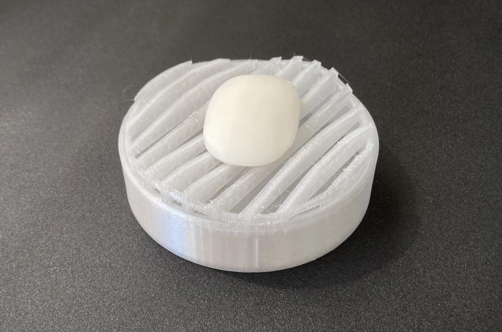
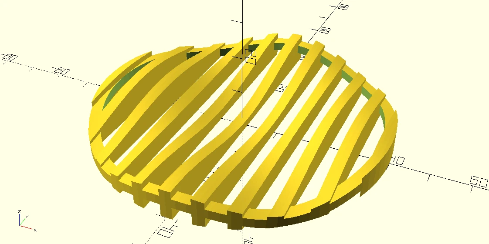
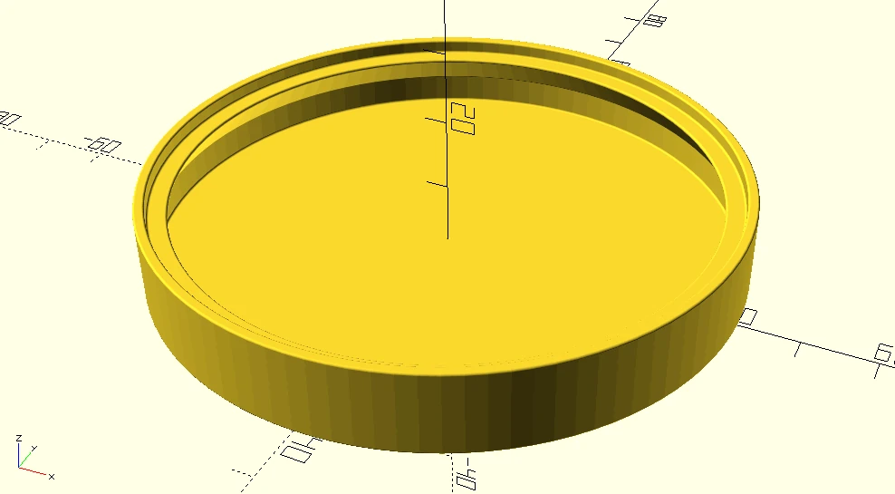

# Circular Wavy Soap Dish
Printables.com user @zach created a [fancy-looking rectangular soap dish](https://www.printables.com/model/213202-modern-soap-dish-with-removable-collection-tray).
I redesigned it with a circular footprint in OpenSCAD.

With a diameter of 8cm and a piece of hotel soap, it looks like this:

(The photos show the first prototype. I've flattened the base and made the beams on the tray thicker afterwards.)

This is a two-part design consisting of a tray (`tray.scad`) and a dish to place the tray on (`base_standalone.scad`).

There is an experimental second type of dish that is meant to fit into a ring-shaped mount originally used with a liquid soap dispenser (`base_ringmount.scad`). I did not print this one yet.

## Print Settings
* printer: Prusa Mini+
* filament: transparent Prusament PETG
    * I need to dry my filament, there was a lot of stringing.
* print settings: 0.2mm, no supports

## Customization
`make.py` creates STLs of soap dishes in several sizes.

For more customization, check the top section of `parts.scad` for all model parameters.

## Future Ideas
Enable minkowski-based rounding once/if https://github.com/openscad/openscad/issues/4039 is fixed.
