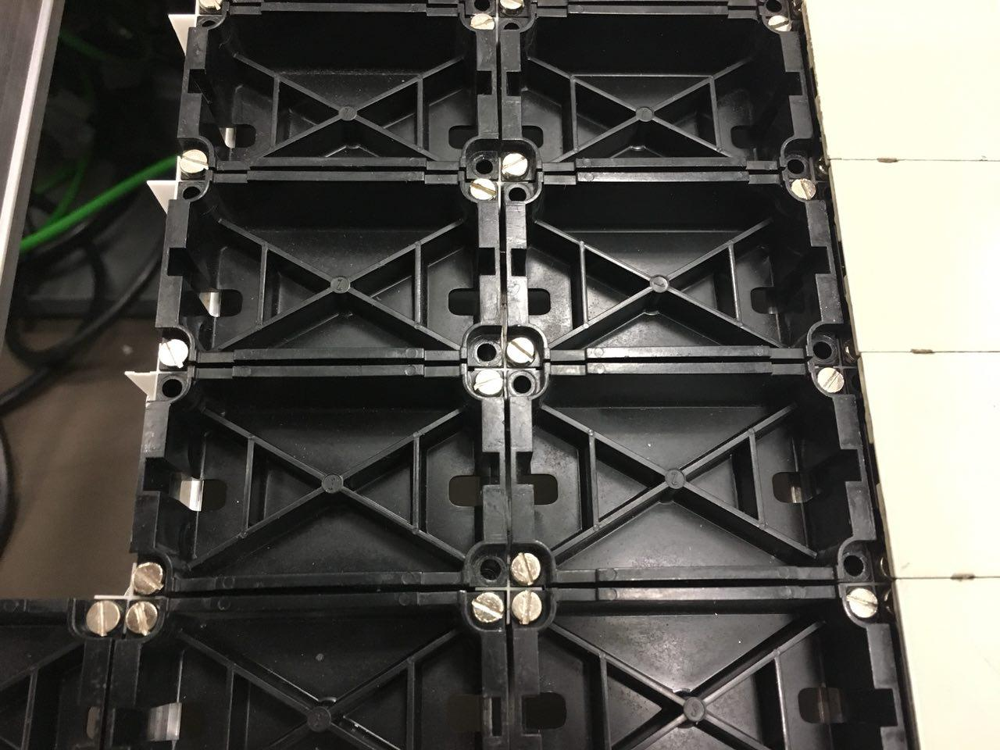
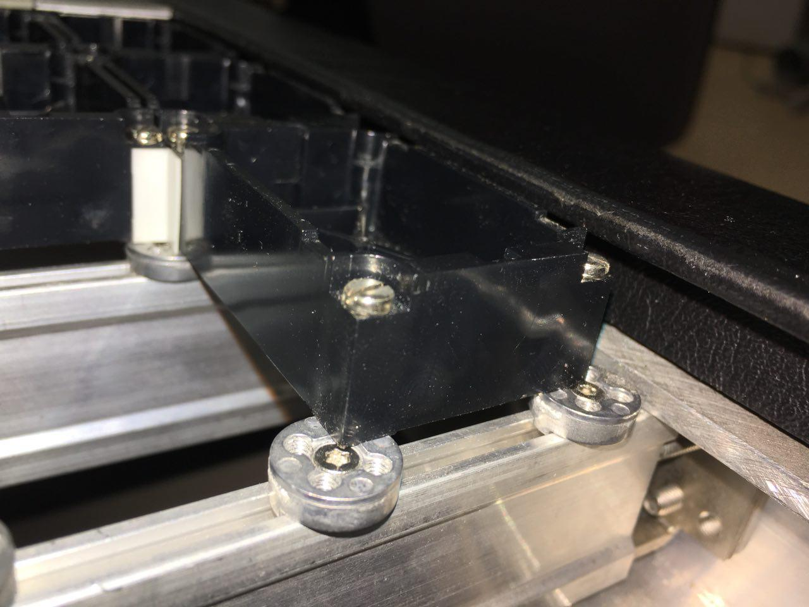

# SpDrS60 Empty Panel Holder
The [control panel of German SpDrS60 railway control centers](https://commons.wikimedia.org/wiki/File:Stelltafel_SpDr60.jpg) consists of [metal panels that are roughly 5cm x 3cm large](https://de.wikipedia.org/wiki/Stelltisch#/media/Datei:SpDrS60_Vorsignal.jpg). Behind every empty panel (one without lights or buttons), there is a plastic holder made of ABS plastic that keeps the panel in place:

All of this is technology [developed in the late 1960s](https://de.wikipedia.org/wiki/Relaisstellwerk#Deutsche_Bundesbahn), so replacement parts are scarce and expensive. Printing the plastic holders is a cheap alternative.

