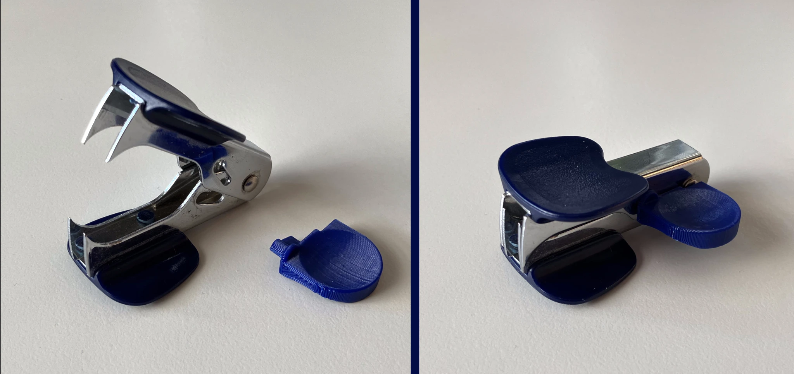

# Staple Remover Locking Pin Replacement
The plastic locking pin on my staple remover disintegrated. Safety first -- I need a replacement.

Design #1 was a replacement of the pin itself, but the 0.4mm nozzle couldn't handle the fine details. Design #2 works like a safety key. The usability of the key solution is actually much better than with the original pin. Less fiddling, and no more guessing whether the current pin position means open or locked.

## Print Settings
* printer: Prusa Mini+
* filament: Spectrum Premium PLA
* print settings: 0.2mm, 20% infill, enable supports
