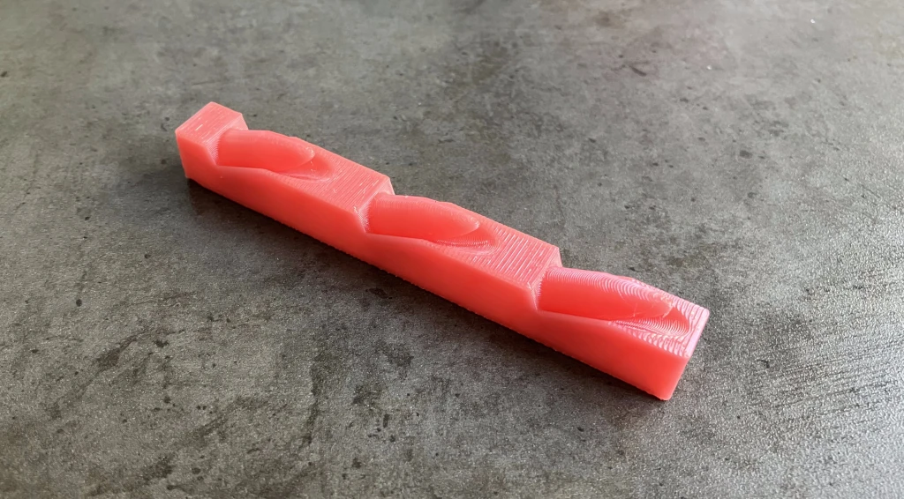
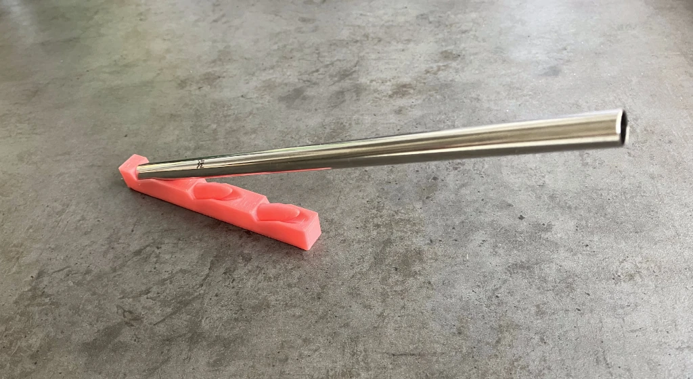
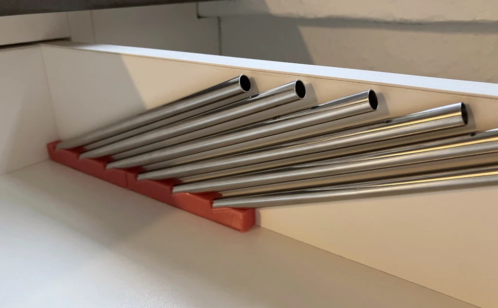
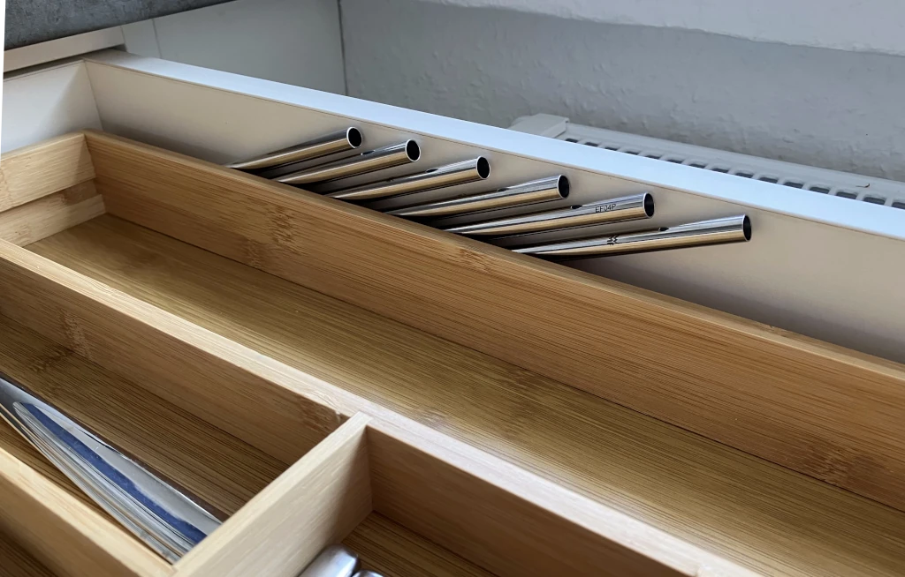

# Space-efficient Straw Rack
Store metal straws (or other hollow tubes) in a drawer.

## Customization
The default size fits WMF-brand metal straws (180mm long, 8mm outside diameter).

To customize, you need to clone the full repo (or download a ZIP archive of it), then open `rack.scad` and use [OpenSCAD's customizer panel](https://en.wikibooks.org/wiki/OpenSCAD_User_Manual/Customizer#Activation_of_Customizer_panel).

These are parameters you definitely will want to adjust:
* `straw_l` straw length
* `drawer_z` inside drawer height (reduce for extra top clearance and the thickness of any adhesive tape you want to use)
* `straw_inner_d`, `straw_outer_d` straw diameters
* `pin_clearance` if the straws do not fit or sit too loose

## Print Instructions
Print orientation: rotate it so the pins for each straw point upward enough that they can be printed without supports, and use paint-on supports for the bottom area.

With PLA, warping can become an issue. I printed a single 6-straw version and the warping led to the straws pointing in all sorts of directions. Printing two 3-straw versions worked better. (For the spacing between the straws, 1x6 vs. 2x3 also makes no difference.)

## Installation
I used thick, removable double-sided tape.
