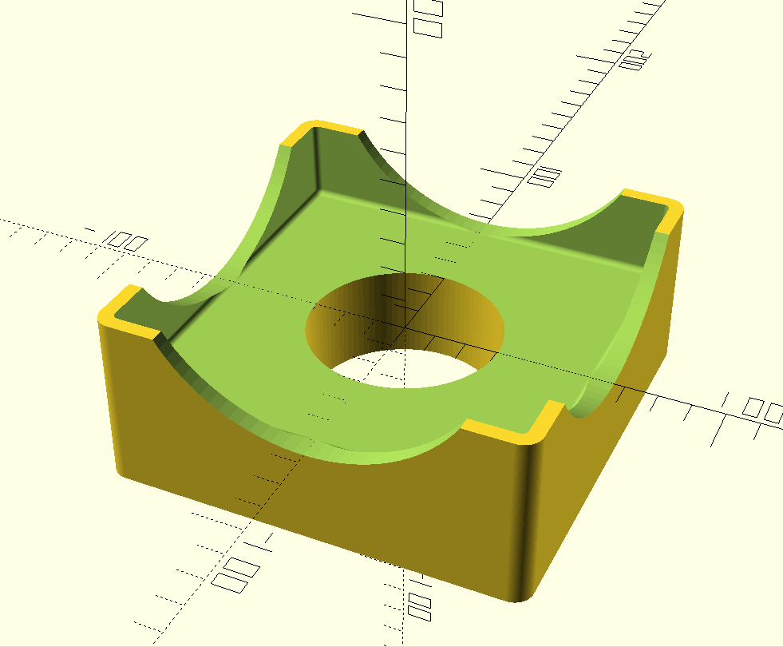
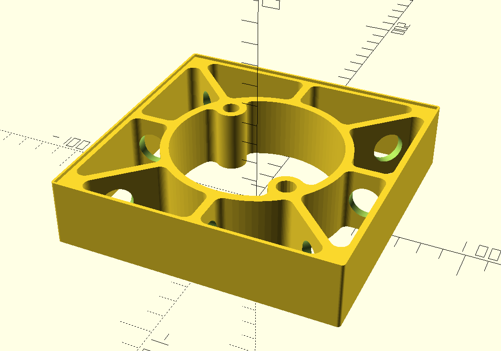
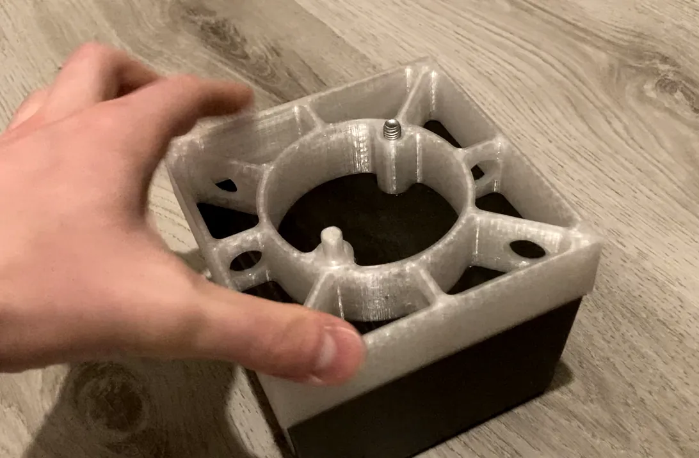

# Extension for IKEA Tidafors Couch Feet
The floor clearance of [IKEA Tidafors couches](https://www.ikea.com/us/en/assembly_instructions/tidafors-sofa-bed__AA-509180-4_pub.PDF): 8cm. The height of a regular robot vacuum incl. wheels: just under 11cm.
Let's raise the couch by 3cm.

## Coaster-like Extension
First idea: put 3cm thick blocks underneath the four couch feet, like coasters for drinks.

I designed it, but didn't print it because:
* Coasters probably fall off when moving the couch, since they're not affixed to the feet.
* Material efficiency could be better: printing with 0.25mm layers and 10% infill would require 100g PETG per foot.

I repurposed this design to raise other furniture with square feet, such as an IKEA Lack table and a plant shelf, so it wasn't a wasted effort.

## Sandwich-like Extension

Second idea: add an extension between the couch and the couch feet.

* Should be more robust than the coaster since it's affixed with screws.
* Shearing forces should be smaller, so we can get away with less material (around 80g).
* Downside: need to buy longer M8 screws, and extensions for the wood plugs on the Tidafors feet.

For better printability, the wood plug extension is a separate printed part (`sandwich_wood_plug_extension.scad`) that screws into the main part.

### Print Settings
* printer: Prusa Mini+
* filament: transparent Prusament PETG
* print settings: default 0.25mm settings with modifications
    * infill: gyroid 15% (less material than grid, and it should stabilize our thin walls better)
    * avoid crossing perimeters (to minimize stringing/blobs)

Make sure to print all threaded parts with the same layer height. Parts will not fit when mixing 0.2mm and 0.25mm.

### Non-printed Parts
* The stock M8 screws are 60mm, so raising by 3cm requires four 90mm M8 screws.
* Don't be an idiot like me and buy screws longer than 90mm. I bought 110mm, and screwing those all the way in still leaves a 2cm gap between screw head and foot because there is not enough thread on the screw to screw it in further.
    * I solved this by printing a 2cm tall hollow cylinder per foot to bridge that gap, see `sandwich_screw_sheath.scad`.

### Print Results

