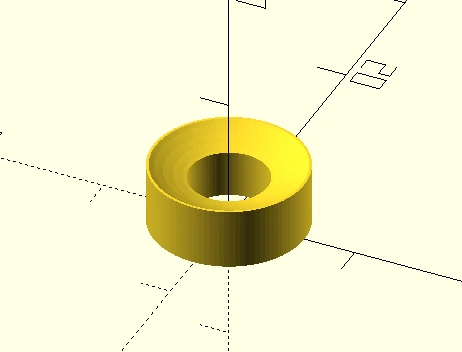

# V-Brake Pad Washer
Swapped [the brake pads](https://www.amazon.de/dp/B004J30NSS) on my bike, then noticed the rear wheel is warped and touches the brakes even when they're not engaged. Bike shop is fully booked, so I'm stuck with the warped wheel for another two weeks.
The temporary solution is a slightly thinner washer to keep the pad from touching the rim. (The old pads are _done_ and switching back is not an option.)

## Print Settings
* PETG
* 100% infill, concentric circles
* 0.2mm layer height
