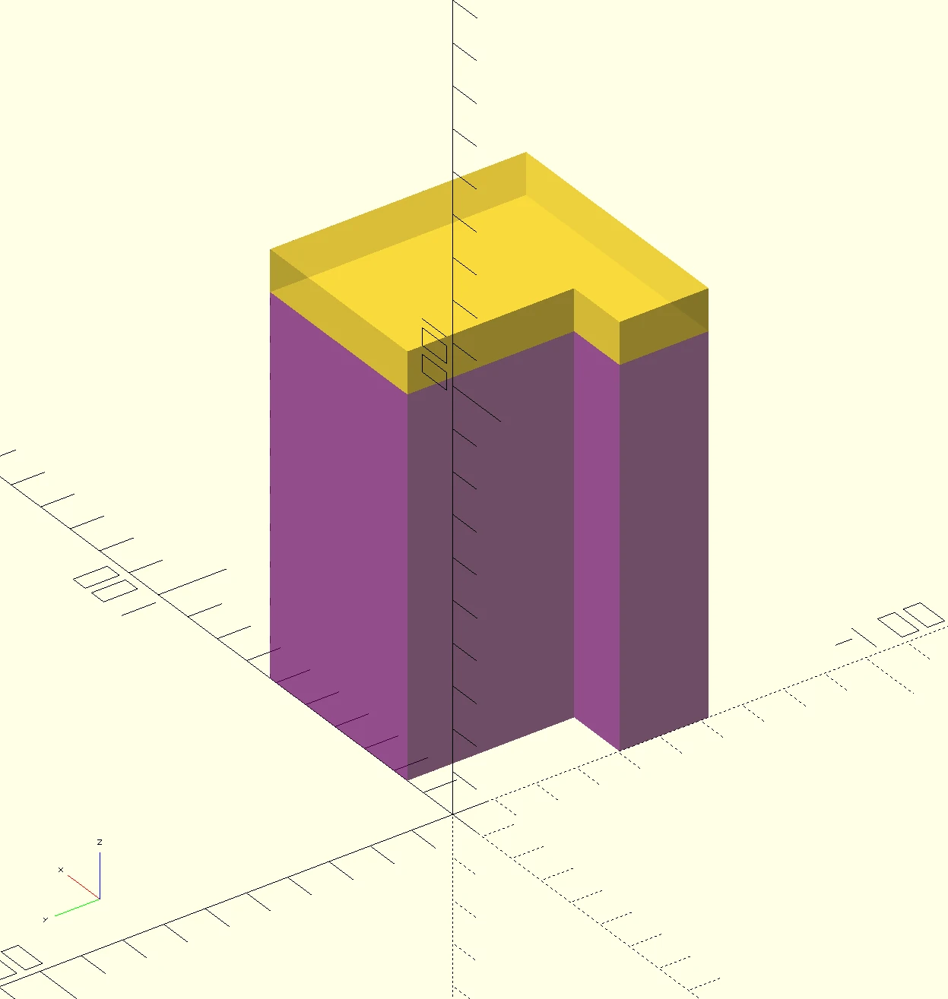
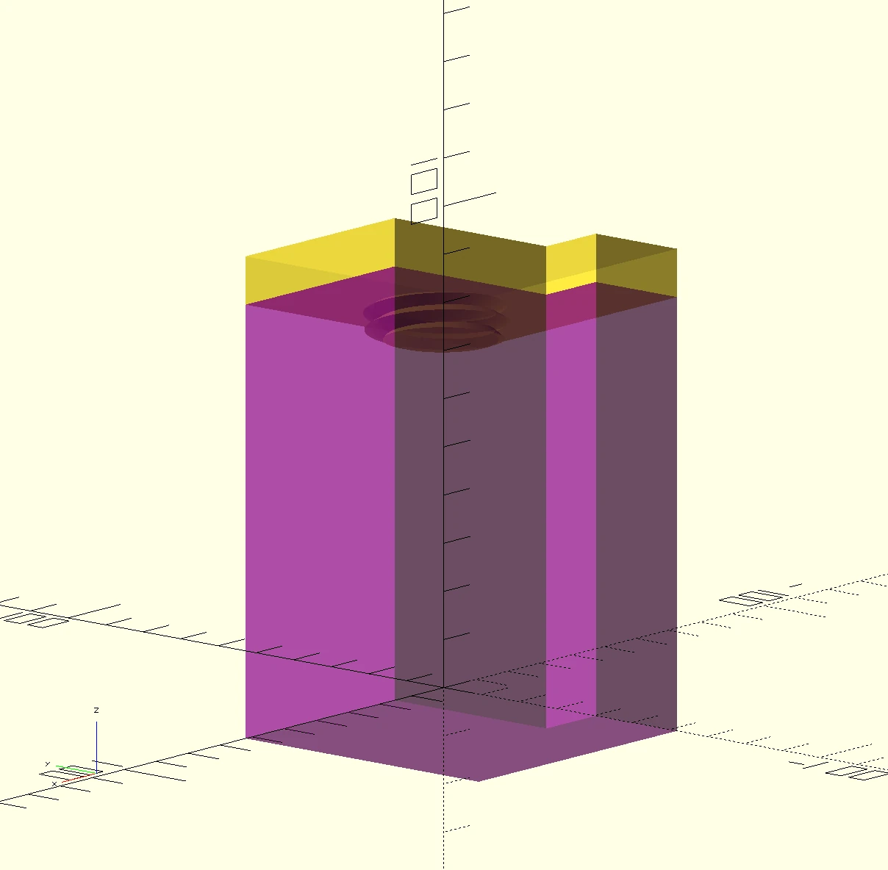

# Window Block
A block that keeps the window open.

Consists of a large hollow part that can be filled with ballast, and a lid that screws into it, sealing it off.
The threads were mirrored one too many times. The parts actually don't fit together like it does in the render.

